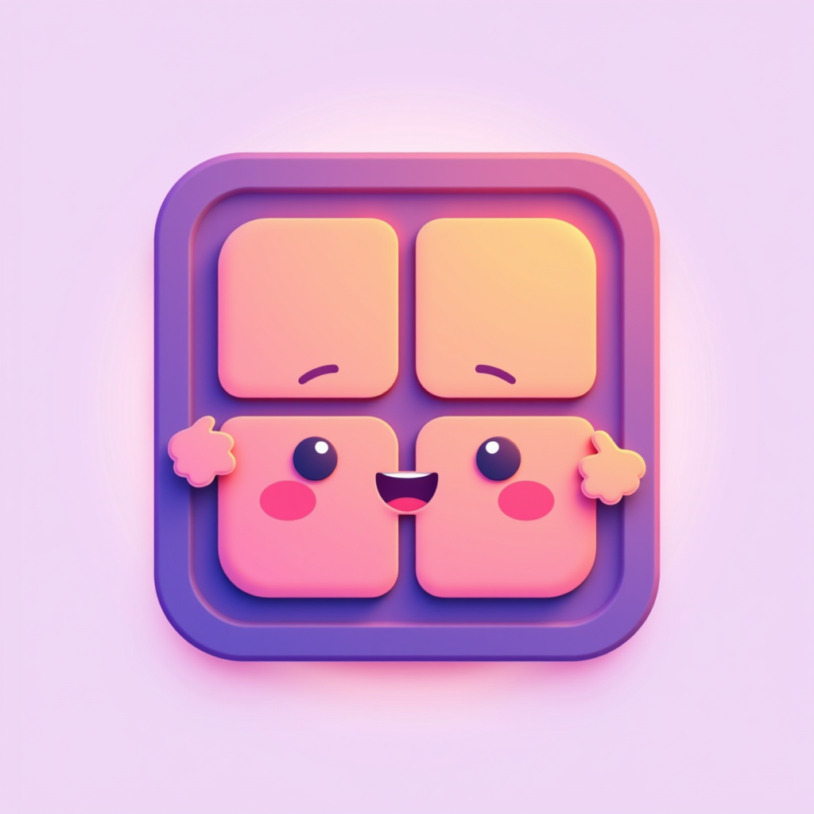

# Yabai-Tomodachi

<p align="center">
  
</p>

<p align="center">
  <b>Your friendly companion app for the incredibly powerful <a href="https://github.com/koekeishiya/yabai">Yabai</a> tiling window manager</b>
</p>

## 🙏 A Tribute to koekeishiya's Yabai

Yabai is a masterpiece of software engineering that transforms macOS window management. Its creator, koekeishiya, deserves the highest praise for building a tool that reduces cognitive overhead by 20-30% when multitasking on macOS. If there were a Nobel Prize for macOS applications, Yabai would win it for all time. 

Yabai-Tomodachi exists to make this incredible power more accessible and friendly.

## 🎯 What is Yabai-Tomodachi?

Yabai-Tomodachi is a companion app that helps you get the most out of Yabai. Think of it as your friendly guide to window management mastery.

### Currently Includes:

**🖱️ Menu Bar App**
- Instant access to essential Yabai commands
- Restart Yabai when it gets stuck (the #1 user request!)
- Quick layout switching without memorizing commands
- Visual access to window controls

**🤖 AI Integration (MCP Server)**
- Natural language window management through Claude
- Query and control windows programmatically
- Build automated workspace workflows
- Future-proof your window management

### Coming Soon:
- Keyboard shortcut manager
- Visual layout designer
- Workspace presets
- And more based on community feedback!

## 🚀 Features

**Essential Controls at Your Fingertips:**
- **Service Management**: Restart, stop, or start Yabai instantly
- **Window Controls**: Balance, float, fullscreen, split, and center windows
- **Layout Switching**: Toggle between BSP (tiling), float, and stack modes
- **Space Management**: Rotate layouts, mirror axes, adjust padding and gaps
- **Quick Actions**: Edit Yabai config, reload settings, even restart the Dock

**AI-Powered Automation:**
- Tell Claude what you want: "Set up my coding workspace"
- Query window information programmatically
- Create complex window arrangements with simple commands
- Build context-aware workspace automation

## 🛠 Installation

### Prerequisites
- macOS 10.14+ (Mojave or later)
- [Homebrew](https://brew.sh) (for easy Yabai installation)
- Node.js v16+ (only for MCP server development)
- Swift (comes with macOS, only for building from source)

### Installing Yabai (if you haven't already)

Yabai-Tomodachi needs [Yabai](https://github.com/koekeishiya/yabai) to work its magic. Here's the quick install:

```bash
# Install Yabai via Homebrew
brew install koekeishiya/formulae/yabai

# Start Yabai
yabai --start-service

# Optional but recommended: Install skhd for keyboard shortcuts
brew install koekeishiya/formulae/skhd
skhd --start-service
```

For detailed Yabai configuration and troubleshooting, check the [official Yabai wiki](https://github.com/koekeishiya/yabai/wiki).

**Quick Install:** We also provide an install script:
```bash
curl -fsSL https://raw.githubusercontent.com/halapenyoharry/yabai-tomodachi/main/install-yabai.sh | bash
```

### Option 1: Install from Package (Easiest)
Download the latest `YabaiTomodachi-1.0.0.pkg` from the [releases page](https://github.com/halapenyoharry/yabai-tomodachi/releases) and double-click to install.

This installs:
- Yabai-Tomodachi app to `/Applications`
- Launch agent (disabled by default)

To auto-start at login:
```bash
launchctl load ~/Library/LaunchAgents/com.yabai.tomodachi.plist
```

### Option 2: Build from Source

1. Clone the repository:
```bash
git clone https://github.com/halapenyoharry/yabai-tomodachi.git
cd yabai-tomodachi
```

2. Run the menu bar app:
```bash
./YabaiRestarter.swift
# Or compile it first:
swiftc YabaiRestarter.swift -o YabaiRestarter
./YabaiRestarter
```

3. For MCP integration with Claude:
```bash
npm install
npm run build
```

Add to Claude Desktop config (`~/Library/Application Support/Claude/claude_desktop_config.json`):
```json
{
  "mcpServers": {
    "yabai-tomodachi": {
      "command": "node",
      "args": ["/path/to/yabai-tomodachi/dist/index.js"]
    }
  }
}
```

## 💡 Usage Examples

### Menu Bar App
Click the menu bar icon to:
- Quickly restart Yabai when windows get stuck
- Switch layouts on the fly
- Balance window sizes
- Adjust gaps and padding

### Claude Integration
Tell Claude things like:
- "Set up my workspace for React development"
- "Move all browsers to space 2"
- "Make the current window float"
- "Balance all windows on this space"
- "Create a new space for documentation"

## 🎨 The Vision

Imagine AI that understands your workspace:
- Automatically arranges windows based on your current task
- Moves documentation to one screen, code to another
- Hides distracting apps when you need to focus
- Saves and restores project-specific layouts
- Responds to natural language workspace requests

## 📝 MCP Tools Available

The MCP server provides 12 tools:

### Query Operations
- `query_spaces` - Get information about all spaces
- `query_windows` - Query windows with filters
- `query_displays` - Get display information

### Window Management
- `focus_window` - Focus by direction or ID
- `move_window_to_space` - Move windows between spaces
- `resize_window` - Resize by pixels
- `toggle_window_property` - Toggle float, sticky, etc.

### Space Management
- `create_space` - Create new spaces
- `destroy_space` - Remove spaces
- `label_space` - Name your spaces
- `set_space_layout` - Change layout modes
- `focus_space` - Switch to specific spaces

## 🤝 Contributing

Contributions are welcome! This project aims to enhance the Yabai experience while respecting its design philosophy.

## 📄 License

MIT License - Same as Yabai, because we believe in the same principles of open software.

## 🙏 Acknowledgments

- **koekeishiya** - Creator of Yabai, the foundation this project builds upon
- The Yabai community for continuous inspiration
- Anthropic for the MCP protocol that enables AI integration

---

*Tomodachi (友達) means "friend" in Japanese. This project aims to be a helpful friend to both Yabai and its users.*